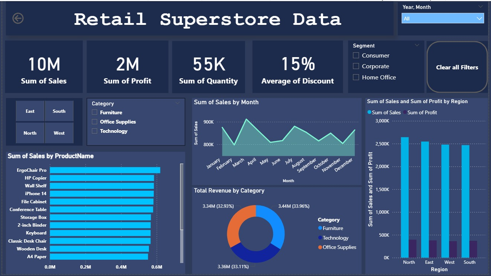
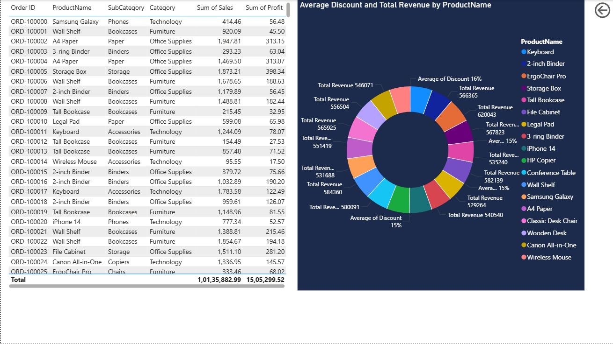

# Retail Superstore Analysis Dashboard

## 📌 Project Overview
This project is an interactive **Power BI dashboard** built using Retail Superstore sales data.  
The dashboard provides insights into:

- Sales Performance
- Profit Analysis
- Product-wise Revenue
- Regional Performance
- Category & Segment Analysis
- Monthly Sales Trends
- Discount Insights

The goal of this project is to help businesses analyze retail performance and make data-driven decisions.

---

## 📊 Dashboard Features

### 🔹 KPI Cards
- Total Sales
- Total Profit
- Total Quantity Sold
- Average Discount

### 🔹 Interactive Filters
- Region Filter
- Category Filter
- Segment Filter
- Year & Month Filter

### 🔹 Visualizations
- Sales by Product Name
- Monthly Sales Trend
- Revenue by Category
- Sales & Profit by Region
- Average Discount vs Revenue
- Detailed Sales Table

---

## 🛠️ Tools & Technologies Used

- **Power BI**
- **MySQL**
- **CSV Dataset**
- **Data Cleaning & Transformation**
- **DAX Measures**
- **Interactive Dashboard Design**

---

## 📂 Project Files

- `Retail SuperStore Analysis.pbix` → Power BI Dashboard File
- `Retail_Superstore_Data.csv` → Dataset Used
- Dashboard Screenshots

---

## 📷 Dashboard Preview

### Main Dashboard

### Detailed Analysis View

---

## 📈 Key Insights

- Technology category generates high revenue.
- North region has the highest sales.
- Discounts significantly impact profit margins.
- Certain products contribute more consistently to revenue.

---
